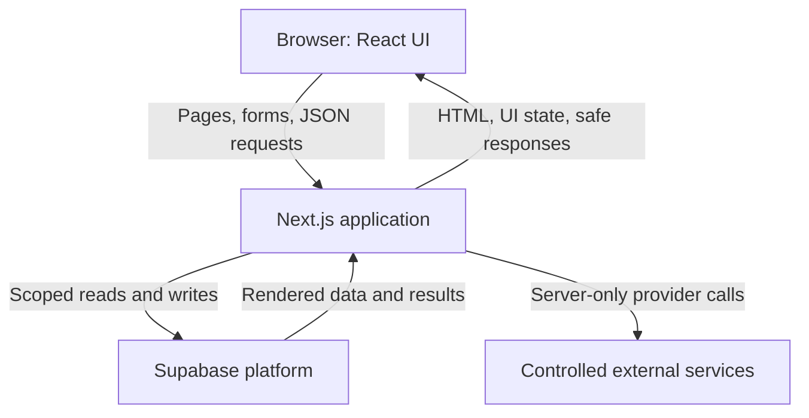
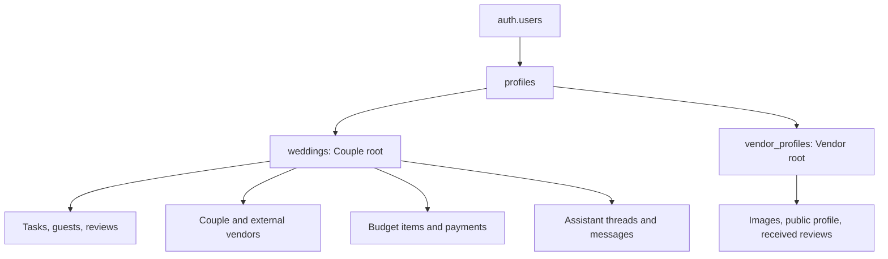
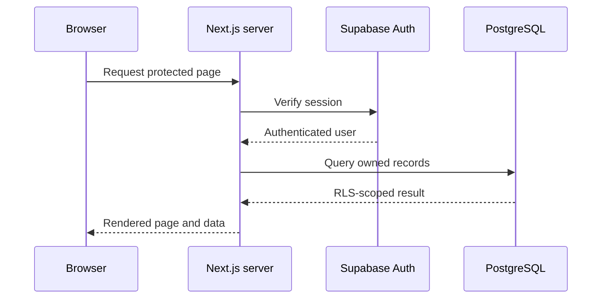
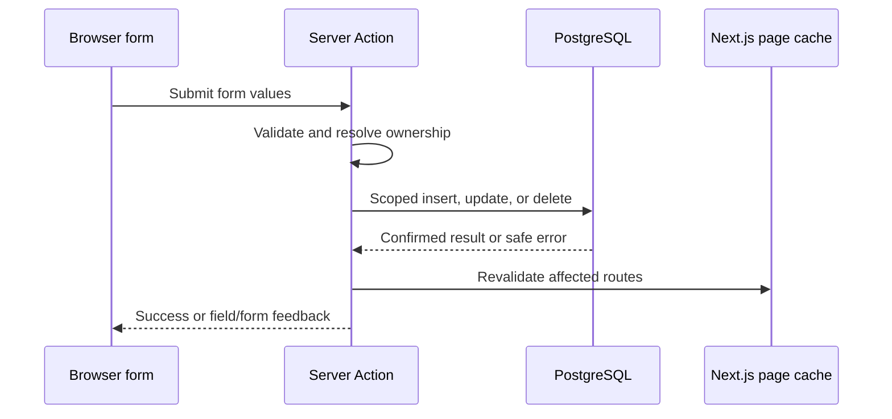
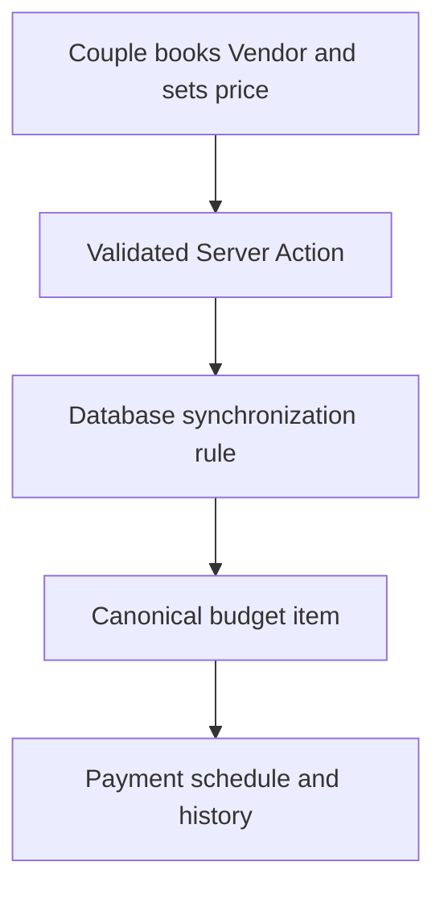
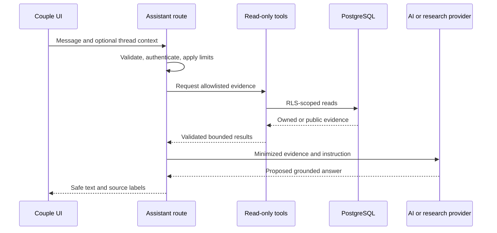
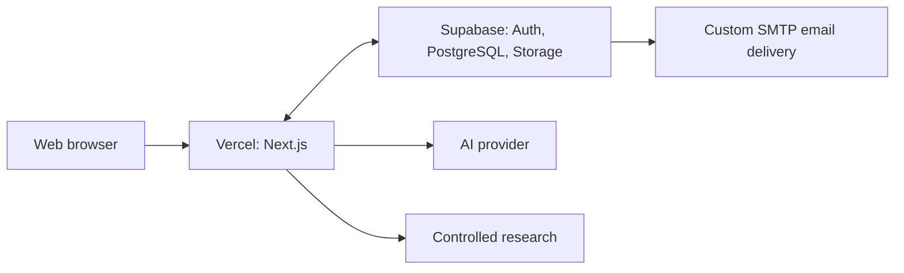

# Ever After — Software Architecture

**Status:** Planned architecture, updated to reflect the implemented application
**Application type:** Responsive full-stack wedding-planning web application
**Primary stack:** Next.js App Router, React, TypeScript, Supabase, PostgreSQL, and Vercel
**Related documents:** `PRD.md`, `TECHNICAL_DESIGN.md`, `SECURITY.md`, `SCALE.md`, `TESTING.md`, and the separate AI design document

---

## 1. Purpose and Scope

This document defines the technical structure of **Ever After** at the software-architecture level. It explains how the system is divided into components, where data is stored, how requests move between the browser, the application server, and the database, and how the architecture separates public access from Couple and Vendor account access.

Ever After serves three connected experiences:

1. A public wedding-vendor marketplace for visitors and authenticated users.
2. A private Couple workspace for wedding planning, tasks, vendors, budget, payments, guests, reviews, and personalized assistance.
3. A private Vendor workspace for maintaining one business profile, public information, gallery content, and reviewing received feedback.

The architecture is designed around one central rule: **each business fact has one authoritative source**. The Dashboard, Timeline, recommendations, and Wedding Assistant read and interpret existing records; they do not create duplicate copies of the same planning information.

This document intentionally stays separate from the other required submission documents:

- The Product Specification explains the business problem, customers, users, objectives, and product capabilities.
- The Detailed Technical Design describes the project folders, detailed component structure, CRUD behavior, validation, state management, error handling, and UX planning.
- The Security document contains the complete threat model, Row Level Security policy analysis, and security controls.
- The Scalability document explains expected growth, bottlenecks, and scaling strategies.
- The Testing documents describe automated and manual validation.
- The AI document explains the Assistant provider loop, tools, grounding, research, privacy, and usage limits in depth.

---

## 2. Architectural Goals and Principles

The system architecture supports the following goals:

- Keep public marketplace content accessible without authentication.
- Keep every Couple's private wedding information isolated from all other accounts.
- Allow a Vendor owner to manage only the business profile connected to that authenticated identity.
- Reuse the same authoritative data across Dashboard summaries, detailed management pages, the Timeline, recommendations, and the Assistant.
- Keep application secrets and external-provider credentials on the server.
- Validate every mutation on the server even when the browser already performs usability validation.
- Use database constraints and Row Level Security as durable protection rather than relying only on page redirects.
- Keep internal form mutations simple through Server Actions instead of creating an unnecessary REST API for every feature.
- Use Route Handlers only where a clear HTTP boundary is useful, especially authentication callbacks and the Wedding Assistant.
- Preserve a responsive, accessible interface on desktop and mobile.
- Allow the public catalog to remain demonstrable through generated local data when Supabase is unavailable in a local preview, while never presenting that fallback as authenticated production data.

### 2.1 Single Sources of Truth

| Domain | Authoritative source | Derived consumers |
| --- | --- | --- |
| Wedding facts and preferences | `weddings` | Our Wedding, recommendations, Timeline context, Assistant context |
| Planning work | `tasks` | Tasks page, Dashboard summaries, Timeline, Assistant |
| Vendor relationship state | `couple_vendors` and `external_vendors` | Our Vendors, Dashboard, Budget synchronization, Assistant |
| Expenses and payment history | `budget_items` and `payments` | Budget page, Dashboard totals, upcoming obligations, Assistant |
| Guest information | `guests` | Guest List, Dashboard summary, Assistant summary |
| Vendor business information | `vendor_profiles` and `vendor_images` | Marketplace, public Vendor pages, Vendor workspace |
| Reviews | `reviews` | My Reviews, public Vendor profiles, Vendor feedback view |
| Assistant history | `assistant_threads` and `assistant_messages` | Assistant conversation interface |

For example, the Timeline is calculated from dated tasks rather than stored in a separate timeline table. Similarly, the Our Wedding Dashboard summarizes task, vendor, guest, and budget data instead of maintaining a second copy of those values.

---

## 3. Technology Stack and External Integrations

### 3.1 Main Technology Choices

| Layer | Technology | Architectural purpose |
| --- | --- | --- |
| Web framework | **Next.js App Router** | Provides routing, layouts, Server Components, Server Actions, Route Handlers, rendering, and deployment integration in one application. |
| User interface | **React** | Implements reusable components and browser-side interaction where needed. |
| Language | **TypeScript** | Provides shared types and compile-time checks across frontend and backend code. |
| Database | **Supabase PostgreSQL** | Stores normalized relational product data and supports constraints, triggers, indexes, and transactions. |
| Authentication | **Supabase Auth** | Manages email/password identities, sessions, email confirmation, and password recovery. |
| Authorization | **PostgreSQL Row Level Security** | Enforces row ownership and role boundaries close to the data. |
| File storage | **Supabase Storage** | Stores images uploaded by authenticated Vendor owners. |
| Validation | **Zod** | Validates Server Action inputs, Route Handler JSON, enums, text lengths, dates, URLs, and numeric values. |
| Hosting | **Vercel** | Hosts the Next.js application and runs its server-side code. |
| Source control | **Git and GitHub** | Maintain application history and provide the source connected to deployment. |
| Assistant rendering | **Safe Markdown rendering in React** | Displays structured Assistant replies while excluding unsafe raw HTML and unsupported content. |
| Automated validation | **Vitest and Playwright** | Support unit/component testing and browser-level flow verification; detailed coverage belongs in the Testing documents. |

Next.js is used as both the frontend framework and the application backend. This avoids maintaining two independently deployed codebases while still preserving a clear boundary between browser code and trusted server code.

### 3.2 External Services

| Service | Use in Ever After | Architectural boundary |
| --- | --- | --- |
| **Supabase Auth** | Registration, login, session management, email verification, forgot-password, and password recovery | The browser receives a session; authorization is rechecked by server code and database policies. |
| **Supabase PostgreSQL** | Persistent relational storage for the application | Access is constrained through grants, RLS, foreign keys, checks, unique rules, and triggers. |
| **Supabase Storage** | Vendor-account image uploads | Uploads use the authenticated Vendor session; database metadata remains ownership-scoped. |
| **Configured AI provider** | Produces grounded wedding-planning responses through the provider-independent Assistant interface | Called only from the server; provider credentials and private context are never exposed to the browser. |
| **Controlled research service** | Supplies current wedding information or market benchmarks when the Assistant is permitted to research | Invoked through a restricted server adapter with minimized input and source receipts; it cannot access the database directly. |
| **Custom SMTP through Supabase** | Delivers account-confirmation and password-reset messages | Email delivery is configured in Supabase rather than implemented as a browser or database feature. |
| **Vercel** | Production deployment and server runtime | Stores deployment configuration and server-side environment values separately from source code. |
| **GitHub** | Repository hosting and deployment source | A push to the connected branch can trigger the normal Vercel deployment workflow. |

The exact Assistant model configuration, tool limits, research policy, and cost controls are documented separately. At the architecture level, the important decision is that AI and research providers sit behind a server-owned interface. They are not allowed to query Supabase directly, and the current Assistant has no product-data write tools.

### 3.3 Deliberately Excluded Integrations

The architecture does not include real credit-card processing, Google Calendar or phone-calendar synchronization, WhatsApp integration, or automatic AI writes to Couple data. Guest List spreadsheet export is also not treated as an implemented architectural component.

---

## 4. High-Level System Components

Ever After is deployed as one Next.js application, supported by Supabase and controlled external services.

### 4.1 Browser and Presentation Layer

The browser renders public, Couple, and Vendor experiences using React components. Pages are responsive and share reusable layout, form, navigation, feedback, status, and loading components.

Browser-owned responsibilities include:

- Displaying server-rendered data.
- Managing transient interaction state such as menus, password visibility, form drafts, wizard steps, filters, dialogs, upload progress, and chat composer text.
- Submitting forms to Server Actions.
- Sending Assistant requests to `/api/assistant`.
- Uploading approved Vendor image bytes to Supabase Storage using the authenticated session.
- Representing marketplace filters and pagination in URL search parameters.

The browser is not trusted to decide ownership, account role, or permission. Hidden controls and route redirects improve the experience, but they do not replace server and database authorization.

### 4.2 Next.js Application Layer

The Next.js application contains the frontend and trusted backend logic:

- **App Router pages and layouts** compose each public or protected experience.
- **Server Components** authenticate when necessary and load data through scoped query functions.
- **Client Components** implement only interactions that require browser state.
- **Server Actions** validate and perform internal application mutations.
- **Route Handlers** implement the authentication callback and Assistant HTTP boundary.
- **Domain services** contain pure, testable rules for recommendations, task timing, budget calculations, booking states, and wedding-date phases.
- **Query modules** perform minimal server-side reads for individual features.
- **Authentication helpers** resolve the current user, role, wedding, or Vendor profile.
- **The session proxy** refreshes Supabase cookies. It is a session-maintenance layer, not the final authorization layer.

### 4.3 Supabase Platform Layer

Supabase provides three separate but connected capabilities:

1. **Auth** owns credentials and authenticated identities.
2. **PostgreSQL** owns durable application data and business constraints.
3. **Storage** owns Vendor-uploaded image files.

Application tables reference Supabase Auth users through `profiles`. RLS policies derive access from the verified `auth.uid()` identity. Database triggers perform operations that must remain correct regardless of which application action caused them, such as initializing a role-specific profile and synchronizing booked-vendor commitments into Budget.

### 4.4 Assistant and Research Layer

The Wedding Assistant uses a server-only provider abstraction. The application, not the model provider, controls authentication, context selection, tool availability, database reads, and response persistence.

At a high level:

1. The Couple submits a message.
2. The server validates the request and verifies the Couple's owned wedding.
3. The Assistant orchestrator may call only allowlisted, read-only application tools.
4. Each tool executes a fixed, scoped query through the application's server data layer.
5. If current external knowledge is necessary and policy permits it, a restricted research adapter receives minimized non-private input.
6. The provider returns an answer grounded in available evidence.
7. The application validates and safely renders the response and stores the owned conversation messages.

This layer cannot directly change tasks, vendors, payments, guests, or Wedding Details.

---

## 5. Application Pages and Route Architecture

Routes are divided by audience. Public pages do not require a session. Protected route layouts verify the session and expected account role before rendering the role-specific application shell.

### 5.1 Public and Authentication Pages

| Route | Purpose |
| --- | --- |
| `/` | Landing page, product explanation, main benefits, and entry points. |
| `/vendors` | Public searchable and filterable Vendor marketplace. |
| `/vendors/[slug]` | Public Vendor profile, gallery, business information, and approved reviews. |
| `/auth/couple` | Couple registration and login. |
| `/auth/vendor` | Vendor registration and login. |
| `/auth/forgot-password` | Request a password-reset email. |
| `/auth/confirm` | Display a non-mutating email-confirmation or recovery page and offer the explicit confirmation action. Merely loading or previewing this route does not consume the token. |
| `/auth/reset-password` | Set and confirm a new password after a valid recovery flow. |
| `/auth/verification` | Present account-confirmation status and next steps. |
| `/auth/callback` | Preserve the legacy Supabase PKCE code-exchange path and redirect safely. |

The public marketplace is shared by anonymous visitors, Couples, and Vendors. Authentication changes the available relationship controls, not the visibility rules for deliberately public Vendor information.

### 5.2 Couple Pages

| Route | Purpose |
| --- | --- |
| `/wedding` | Our Wedding dashboard with date/countdown and summaries of authoritative feature data. |
| `/wedding/setup` | Optional, skippable guided wedding setup and initial Vendor declarations. |
| `/wedding/details` | View and edit the stored Wedding Details. |
| `/wedding/timeline` | Chronological view derived from dated Tasks. |
| `/tasks` | Create, filter, update, complete, reopen, and delete Tasks. |
| `/vendors/my` | Manage saved, contacted, considered, booked, rejected, and External Vendors. |
| `/budget` | View calculated totals and manage expenses, commitments, payment schedules, and paid history. |
| `/guests` | Manage guest or household records and attendance summaries. |
| `/reviews` | Create and manage Couple-authored Vendor reviews. |
| `/assistant` | Use the bilingual, grounded Wedding Assistant and conversation history. |
| `/settings` | View account context, manage permitted settings, and log out. |

There is no independent Wedding Week dashboard, Payment dashboard, Wedding Profile copy, or Compare page. Wedding-week states appear within the existing date area, payments belong to Budget, Wedding Details is the editable wedding source, and comparisons are provided through existing marketplace or Assistant experiences.

### 5.3 Vendor Pages

| Route | Purpose |
| --- | --- |
| `/vendor` | Vendor dashboard showing business-profile completion, rating, and recent-review summary. |
| `/vendor/profile` | Edit the owned business profile, service attributes, public contact information, publication state, and gallery. |
| `/vendor/explore` | Enter the shared public Vendor marketplace. |
| `/vendor/settings` | View Vendor account context and log out. |

Vendor Profile Setup and ongoing Business Profile editing use the same profile route and source of truth rather than separate duplicated records.

### 5.4 Route Protection

Route protection has several layers:

- The session proxy refreshes authentication cookies and supports correct navigation behavior.
- Protected route-group layouts verify that a valid Supabase session exists.
- Role-aware layouts ensure that Couple pages are not used as Vendor management pages and vice versa.
- Server queries and actions resolve the authenticated ownership root again.
- PostgreSQL grants and RLS enforce the final row-level boundary.

No route-level check is treated as sufficient authorization by itself.

---

## 6. Database Architecture

Ever After uses a relational PostgreSQL database because the product contains strong ownership relationships, structured planning records, financial dependencies, public/private visibility rules, and cross-feature summaries. A document-only or browser-only data store would not provide the same integrity guarantees.

Supabase Auth owns credentials in `auth.users`. The application's public schema stores product records. UUID primary keys provide stable identities. Foreign keys express relationships. Check and unique constraints reject invalid durable state. Indexes support ownership lookups, marketplace filtering, ordering, and pagination. Money is stored as integer agorot in `*_minor` fields to avoid floating-point rounding errors. Wedding and due dates are stored as calendar dates, while audit events use timestamps.

### 6.1 Ownership Model

The ownership roots are intentionally simple:

- An authenticated Couple owns one `profiles` record with role `couple` and one `weddings` record. The wedding is the parent of private planning data.
- An authenticated Vendor owns one `profiles` record with role `vendor` and one `vendor_profiles` record. That Vendor profile is the parent of owned business media and management data.
- Anonymous visitors own no application records and may read only deliberately public information.

### 6.2 Main Tables and Entities

| Entity | Architectural responsibility | Main relationships |
| --- | --- | --- |
| `auth.users` | Supabase-managed credentials and authentication identity | One-to-one with `profiles` |
| `profiles` | Application role and account-level information | Parent of one Couple wedding or one owned Vendor profile |
| `weddings` | Wedding date, setup status, area, event type, guest estimate, total budget, styles, priorities, and other wedding preferences | Private ownership root for Couple data |
| `tasks` | Planning actions, due dates, priorities, categories, and workflow statuses | Belongs to one wedding |
| `guests` | Guest or household information and RSVP/attendance-related values | Belongs to one wedding |
| `vendor_categories` | Stable top-level service taxonomy | Parent of `vendor_subcategories` and referenced by Vendor records |
| `vendor_subcategories` | Stable detailed service taxonomy | Belongs to one category and is referenced by Vendor records |
| `vendor_profiles` | Business identity, marketplace attributes, service areas, pricing range, capacity, public contact information, and publication state | Optionally owned by a Vendor account; referenced by relationships and reviews |
| `vendor_images` | Ordered Vendor image metadata using either a Storage path or a controlled public URL | Belongs to one Vendor profile |
| `external_vendors` | Private Couple-owned businesses that are not represented by a marketplace Vendor profile | Belongs to one wedding |
| `couple_vendors` | Saved state, relationship lifecycle, agreed price, and private notes for a marketplace or External Vendor | Joins one wedding to exactly one Vendor identity |
| `reviews` | Couple-authored and seeded public Vendor feedback | References a Vendor; ordinary reviews reference the authoring wedding |
| `budget_items` | Manual expenses and canonical booked-vendor financial commitments | Belongs to one wedding; may link to one Couple-vendor relationship |
| `payments` | Scheduled or completed amounts, dates, status, and notes | Belongs to one Budget item |
| `assistant_threads` | Owned conversation container | Belongs to one wedding |
| `assistant_messages` | User/assistant message text and source labels | Belongs to one Assistant thread |

### 6.3 Principal Relationships and Constraints

- One `profiles` row exists per authenticated user.
- One `weddings` row exists per Couple owner.
- One owned `vendor_profiles` row exists per Vendor owner.
- Each private planning row is connected to a wedding either directly or through a protected parent.
- A `couple_vendors` record references either a marketplace Vendor or an External Vendor, never both.
- A wedding can have only one relationship to a particular Vendor identity, but can have multiple Vendors in the same category.
- An ordinary Couple review is unique for a wedding and Vendor pair; seeded demonstration reviews remain separately identified.
- Ratings are constrained to valid values and count/money fields reject invalid negatives where appropriate.
- Minimum price or capacity cannot exceed its maximum.
- A Vendor image has exactly one source: a Storage path or a controlled URL.
- A canonical booked-vendor Budget item is unique for its relationship and is retained when required to preserve payment history.
- Foreign-key behavior and database rules prevent relationship deletion from silently deleting protected financial history.

### 6.4 Database-Owned Business Rules

Some invariants belong in PostgreSQL rather than only in application code:

- A signup trigger creates the correct role-specific application records after a Supabase Auth user is created.
- A booked Vendor relationship with an agreed price creates or updates one canonical booked-vendor Budget item.
- Unbooking clears the active commitment but preserves the canonical item and historical payments.
- Payment insertions and amount increases are checked against the active positive commitment under database locking.
- RLS verifies that the current identity owns the required wedding or Vendor profile.
- Public Vendor and review reads expose only deliberately public information.

These rules protect integrity even when several application pages consume or mutate the same domain.

---

## 7. Server Actions, Route Handlers, and Storage Interfaces

### 7.1 Why Server Actions Are Used

Most Ever After mutations belong to authenticated internal forms. They do not need to be published as a general REST API. Server Actions provide a direct typed path from a React form to trusted server code while preserving server-side validation, ownership lookup, database access, safe feedback, and route revalidation.

The main Server Action groups are:

| Action group | Required operations |
| --- | --- |
| Authentication | Couple/Vendor signup, login, logout, explicit token-hash confirmation, password-reset request, password update, and permitted account changes |
| Wedding | Save Wedding Details, save or skip Setup, and manage setup declarations |
| Tasks | Create or edit a Task, update status, and delete an owned Task |
| Guests | Create, update, and delete owned Guest records |
| Vendor relationships | Save or unsave a Vendor, set lifecycle status, update agreed price and notes, and create/manage External Vendors |
| Reviews | Create, update, and delete a Couple-authored review |
| Budget and payments | Manage permitted manual Budget items and Payment records |
| Vendor account | Update the owned business profile, change publication state, and register or remove image metadata |
| Assistant history reads | Load owned thread and message pages for the conversation interface |

Each mutation follows the same architectural pattern:

1. Parse and validate the submitted data.
2. Authenticate the current user.
3. Verify the required role.
4. Resolve the owned wedding or Vendor profile on the server.
5. Perform a narrowly scoped database operation.
6. Inspect the database result and reject zero-row or ambiguous outcomes.
7. Return safe success or field/form error information.
8. Revalidate only the routes that consume the changed data.

Client-supplied owner identifiers are not accepted as proof of ownership.

### 7.2 Required Route Handlers

| Method | Route | Access | Responsibility |
| --- | --- | --- | --- |
| `GET` | `/auth/callback` | Public authentication return | Exchange the Supabase PKCE code for a session and redirect to the appropriate safe application destination. |
| `POST` | `/api/assistant` | Authenticated Couple | Validate the chat request, verify the owned wedding, load permitted context, run the bounded Assistant flow, persist owned messages, and return safe text and source labels. |

The authentication callback is a Route Handler because Supabase returns an HTTP authorization code that must be exchanged on the server. The Assistant uses a Route Handler because JSON request/response semantics, provider calls, request limits, and explicit error codes form a natural HTTP boundary.

`/auth/confirm` is deliberately a render-only Server Component page rather than a mutating `GET` Route Handler. It validates the supported `email` or `recovery` request shape and binds the token to the `confirmEmailToken` Server Action. Only an explicit form submission may call `verifyOtp()`. The action verifies at most once, confirms that the resulting session persisted through the server cookie handoff, resolves the stored application role for email confirmation, and then redirects to `/wedding`, `/vendor`, or `/auth/reset-password` as appropriate. Role and destination values supplied in the URL are ignored.

No ordinary Task, Guest, Budget, or Vendor-management REST endpoint is required. Those flows remain internal Server Actions.

### 7.3 Vendor Image Storage Interface

Vendor image bytes use Supabase Storage rather than passing through a large general-purpose Next.js JSON endpoint. The authenticated Vendor session is used for the upload. The application validates type, size, and ownership, then registers only controlled file metadata in `vendor_images`. Removing an image also verifies Vendor ownership.

The synthetic demonstration marketplace uses tracked, optimized WebP assets in the application rather than uploading those files through Vendor accounts. The two image sources therefore remain architecturally separate.

---

## 8. Information Flow Between Frontend, Backend, and Database

### 8.1 Standard Protected Page Read

The page does not trust an owner ID from the URL or browser form. The server derives the user from the session and the database applies RLS before returning rows.

### 8.2 Standard Server Action Mutation

The UI shows success only after persistence is confirmed. Failed forms preserve the user's draft where possible.

### 8.3 Authentication Flow

1. A Couple or Vendor submits the correct role-specific registration or login form.
2. A Server Action validates the fields and calls Supabase Auth.
3. On signup, Supabase Auth creates the identity and a database trigger initializes the application `profiles` record and the role-specific `weddings` or `vendor_profiles` row.
4. When email confirmation is enabled, Supabase sends the configured confirmation email through Custom SMTP.
5. The token-hash email link opens `/auth/confirm`. This initial `GET` renders the confirmation page without consuming the one-time token, so ordinary previews and `GET`-only email scanners cannot complete the verification.
6. The user explicitly submits **Verify email and continue**. The bound Server Action verifies the token no more than once, confirms the cookie-backed session through a fresh server client, and resolves the stored application profile.
7. A confirmed Couple continues to `/wedding`; a confirmed Vendor continues to `/vendor`. The action does not trust URL-supplied roles, `next` values, or destinations. Missing or inconsistent profiles fail closed through the controlled recovery state.
8. Session cookies identify later requests, while database ownership remains enforced by RLS.

Password recovery follows the same prefetch-safe separation. The recovery email opens the same non-mutating `/auth/confirm` page with `type=recovery`; only the explicit **Continue to reset password** submission verifies the token and establishes the recovery session. A recognized recovery session can continue only to `/auth/reset-password`, and the completed password update signs the account out before normal login. The legacy `/auth/callback` authorization-code route remains supported for backward compatibility. Password-reset and account-confirmation emails are not stored as application database records.

### 8.4 Couple Planning Flow

For a Task update:

1. `/tasks` reads only the authenticated Couple's wedding and Task rows.
2. The Couple submits the Task form or a quick status action.
3. The Server Action validates the Task and resolves the owned wedding again.
4. PostgreSQL verifies ownership and durable constraints.
5. On success, the action revalidates Tasks, Our Wedding, Timeline, and Assistant consumers.
6. The Timeline groups the same dated Task rows; no duplicate timeline write occurs.

Wedding Details, Guests, reviews, and ordinary Budget mutations follow the same read–validate–authorize–mutate–revalidate structure.

### 8.5 Marketplace and Vendor-Relationship Flow

1. The browser expresses search, category, subcategory, area, price, rating, capacity, Friday availability, service, and page values in the URL.
2. A Server Component parses the parameters and queries only published Vendor data.
3. If the viewer is an authenticated Couple, the server also loads the permitted wedding and budget evidence required for deterministic recommendation scoring.
4. The recommendation domain function returns a normalized score and human-readable reasons without hiding non-matching Vendors.
5. When the Couple clicks Save or changes a relationship status, a Server Action resolves the owned wedding and updates `couple_vendors`.
6. A booked relationship with an agreed price activates the database-owned Budget synchronization rule.
7. Relevant marketplace, Our Vendors, Dashboard, Budget, Setup/Details, and Assistant pages are revalidated.

The Save control must behave as an action within the current page. Saving a Vendor is not intended to navigate to the top of the marketplace; the currently observed scroll-reset behavior is a UI defect to be corrected separately, not an architectural rule.

### 8.6 Booked Vendor and Budget Flow

The application does not create a separate manual expense after booking. The database creates or reuses one canonical `budget_items` row. This prevents duplicate commitments when the same relationship is changed from Setup, Our Vendors, or another authorized surface.

### 8.7 Vendor Profile and Image Flow

1. The Vendor opens `/vendor/profile` through the Vendor-protected shell.
2. The page loads the profile linked to the current Vendor identity.
3. Text and structured business fields are submitted to a Server Action and validated.
4. Image bytes are validated and uploaded to the owned Supabase Storage path.
5. Controlled image metadata is added to `vendor_images`.
6. Only explicitly published business information and approved public image fields become visible on public marketplace routes.
7. Other Vendors may view that public page but cannot access its private management information.

### 8.8 Wedding Assistant Flow

Only the application's server tool layer holds database access. Research adapters receive minimized wedding-domain queries rather than private raw records. Assistant messages are stored only under the verified wedding and thread. No Assistant tool can create, update, or delete product data.

---

## 9. Users, Roles, and Permissions

Ever After has three access contexts. The role is stored in the application profile and verified against the authenticated identity. Mutable client state or untrusted authentication metadata alone is not used as authorization.

| User context | Main permissions | Explicit restrictions |
| --- | --- | --- |
| **Anonymous visitor** | View the landing page, marketplace categories, published Vendor profiles, public images, and approved public reviews; access authentication and recovery pages | Cannot read private wedding data, Vendor management fields, private notes, ownership links, Assistant history, or authenticated actions |
| **Couple account** | Read and manage its own wedding, Tasks, Guests, Vendor relationships, External Vendors, Budget items, Payments, reviews, settings, and Assistant conversations; read public marketplace data | Cannot access another Couple's records, another Vendor's management data, server secrets, or direct AI write operations |
| **Vendor account** | Read and update its own business profile and images; control publication; view reviews received by that business; browse the public marketplace | Cannot read Couple-private planning records, mutate Couple-authored reviews, or access another Vendor's private management/ownership data |

### 9.1 Permission Enforcement by Resource

| Resource | Public read | Couple access | Vendor-owner access |
| --- | --- | --- | --- |
| Wedding, Tasks, Guests, Budget, Payments | No | Own wedding only | No |
| Couple-vendor relationships and private notes | No | Own wedding only | No |
| External Vendors | No | Own wedding only | No |
| Published Vendor profile fields | Yes | Yes | Yes |
| Unpublished/private Vendor management fields | No | No | Owned business only |
| Vendor images | Published images only | Published images only | Manage owned images |
| Reviews | Approved public fields | Public fields plus own review management | Public/received read only; no Couple-review mutation |
| Assistant threads and messages | No | Own wedding only | No |
| Vendor taxonomy | Yes | Yes | Yes |

### 9.2 Authorization Layers

Permissions are enforced at multiple levels:

1. Navigation and route layouts present the correct interface for the current role.
2. Server Components and Server Actions verify the current user and expected role.
3. Query and action code derives ownership roots from the session.
4. PostgreSQL grants and RLS restrict rows based on `auth.uid()` and stored ownership relationships.
5. Foreign keys, constraints, and triggers preserve data integrity after authorization succeeds.
6. Public database views or queries expose only explicit public columns rather than unrestricted management rows.

This layered approach means that a forged request cannot gain access merely by bypassing the visible interface.

---

## 10. Deployment and Runtime Topology

The repository is stored in GitHub. The production project is connected to Vercel, so a normal push to the configured production branch initiates the standard deployment workflow. Database schema changes are managed separately through reviewed Supabase migrations; a frontend deployment does not automatically redesign the database or reset Supabase Auth and SMTP settings.

Runtime configuration is separated by visibility:

- Public Supabase connection values may be available to approved browser code.
- Service-role credentials, AI-provider keys, research credentials, and other secrets remain server-only.
- SMTP credentials are configured in Supabase and do not belong in the repository or Vercel browser bundle.
- Local environment files and production environment settings are not committed.

The Next.js application, database, Storage, and external providers remain separate failure domains. Public pages can degrade more gracefully than authenticated data flows, and external AI/research failures do not permit unauthorized direct database access.

---

## 11. Main Architectural Decisions

### 11.1 One Full-Stack Next.js Application

Using the App Router allows pages, server rendering, mutations, and the small number of HTTP endpoints to live in one TypeScript project. The architecture remains modular through route groups, feature components, query modules, action modules, validation schemas, and domain functions rather than through separate deployable microservices.

### 11.2 Relational Database with Wedding-Centered Ownership

Most private Couple data naturally belongs to one wedding. Making `weddings` the ownership root simplifies RLS reasoning and prevents unrelated users from sharing identifiers as proof of access. Vendor ownership has its own parallel root through `vendor_profiles`.

### 11.3 Server Components for Reads and Server Actions for Internal Writes

Server Components keep initial private data loading off the browser and allow direct scoped queries. Server Actions avoid a large repetitive CRUD API while still providing a trusted validation and authorization boundary.

### 11.4 Route Handlers for External Protocol Boundaries

The authentication callback and Assistant request are intentionally explicit HTTP routes. They need redirect or JSON semantics, provider integration, bounded request handling, and predictable status outcomes that ordinary form actions do not require.

### 11.5 RLS as the Final Authorization Layer

The proxy and page layouts improve routing and user experience, but they can be bypassed by a direct request. RLS is therefore required on private tables and ownership-sensitive operations. Application checks and database policies reinforce one another.

### 11.6 Database-Owned Financial Synchronization

A booked relationship can be updated from more than one feature. Synchronizing its canonical Budget commitment in PostgreSQL prevents two pages from implementing competing write logic and preserves financial history when a booking state changes.

### 11.7 Deterministic Recommendations Separate from AI

Marketplace recommendations use a transparent weighted domain function. This makes the result explainable and testable. The Assistant may explain or contextualize Vendor choices, but the ordinary **Recommended for you** badge does not depend on an opaque model response.

### 11.8 Minimal Client State

PostgreSQL remains the durable source of truth; URL parameters own searchable list state; React owns only temporary interaction state. A global state framework is unnecessary for the current application architecture and would risk creating another stale copy of server data.

### 11.9 Read-Only Assistant Access to Product Data

AI-generated text is not permission to mutate wedding records. The Assistant can request only allowlisted reads, and the application verifies every read against the current Couple. Any future write capability would require a separate proposal, explicit user confirmation, fresh authorization, and server-side revalidation architecture.

### 11.10 Synthetic Marketplace Data Is Not External Market Truth

The demonstration catalog is reproducible synthetic data. Connected environments use published database records, while a generated local fallback supports public preview. Neither source may be treated as a complete representation of the real Israeli wedding market or as a substitute for current external research.

---

## 12. Architectural Boundaries and Non-Goals

The following boundaries prevent the architecture document from implying features that Ever After does not provide:

- A Couple account is one shared workspace with one primary authentication identity; it is not two independent partner logins.
- The optional second email is contact information only and does not create another authentication identity.
- Ever After records payment schedules and paid amounts but does not process real credit-card payments.
- The Timeline is a derived Task view, not a second planning database.
- Wedding-week and wedding-day states are part of the existing date presentation, not a separate operational dashboard.
- Vendor declarations in Setup are not confirmed bookings until an identified relationship has `booked` status.
- A saved Vendor is not automatically booked, and `is_saved` remains independent from lifecycle status.
- The Assistant cannot execute writes and cannot treat synthetic Vendor prices as current market research.
- Calendar synchronization, WhatsApp integration, seating management, and completed spreadsheet export are outside the implemented architecture.

---

## 13. Traceability to the Course Requirements

| Course requirement | Where it is covered |
| --- | --- |
| What components the system will have | Sections 3–4 |
| Whether a database will be used | Section 6 |
| Main database tables or entities | Sections 6.1–6.3 |
| Application pages | Section 5 |
| Required Server Actions or API Routes | Section 7 |
| Information flow between Frontend, Backend, and Database | Section 8 |
| Users and permissions | Section 9 |
| External libraries or services and why they are used | Section 3 |

---

## 14. Summary

Ever After uses a layered full-stack architecture in which React and Next.js provide the user experience and trusted application server, Supabase Auth identifies users, PostgreSQL and RLS own durable data and permissions, Supabase Storage manages Vendor uploads, and controlled server-only adapters isolate external AI, research, and email services.

The architecture supports public discovery, private Couple planning, and Vendor business management without duplicating domain records or trusting the browser with authorization. Server Components perform scoped reads, Server Actions handle internal mutations, Route Handlers provide explicit protocol boundaries, and database rules protect ownership and financial integrity. This structure directly enables the product capabilities defined in the Product Specification while leaving detailed implementation, security, scalability, testing, and AI mechanics to their dedicated documents.
