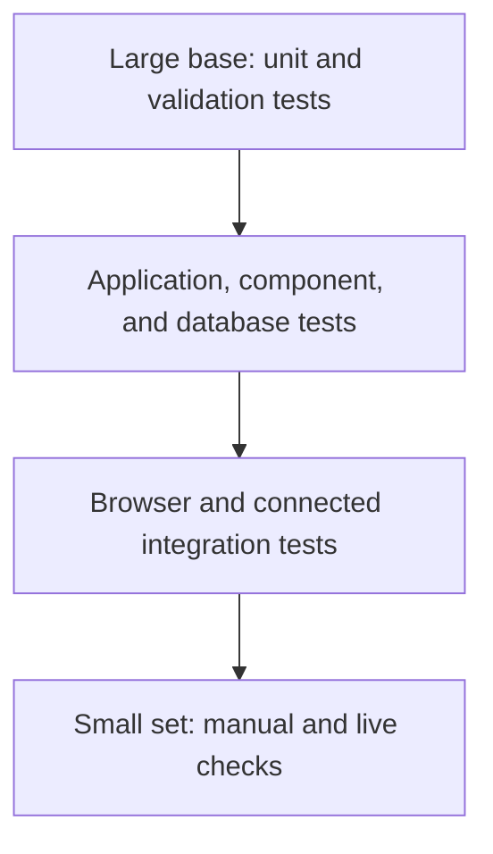

# Ever After — Test Specification

**Status:** Test specification aligned with the implemented application and recorded validation
**Application type:** Responsive full-stack wedding-planning web application
**Primary test technologies:** Vitest, Playwright, PostgreSQL test runners, TypeScript, ESLint, and production builds
**Related documents:** `PRD.md`, `ARCHITECTURE.md`, `TECHNICAL_DESIGN.md`, `SECURITY.md`, `SCALE.md`, the separate AI design document, and the companion `TESTING_MANUAL.md`

---

## 1. Purpose of This Document

This document defines **what must be tested and what counts as a passing result** for Ever After. Its purpose is not to list every test file or every assertion in the repository. Instead, it organizes validation around the product's most important features, invalid inputs, business processes, permissions, database invariants, edge cases, and user-interface behavior.

Ever After works correctly only when all of the following are true:

- Public visitors can access only the deliberately public experience.
- Couples can plan their own wedding without seeing or changing another Couple's data.
- Vendor owners can manage only their own business information.
- Core records persist correctly and appear in every derived view that depends on them.
- Invalid or inconsistent input is rejected without corrupting stored data.
- Financial calculations and booked-Vendor synchronization preserve one source of truth.
- The Assistant uses only authorized evidence, remains read-only, handles failures safely, and does not expose private configuration.
- Authentication, verification, and recovery flows work from the user's point of view.
- The interface remains usable at representative desktop, tablet, and mobile widths.
- Expected failures produce safe feedback rather than crashes, false success messages, or information leaks.

A test is marked as passed only when it actually ran in the appropriate environment. A mocked test proves deterministic application behavior at the mocked boundary; it does not prove that a live third-party provider will always respond correctly. A local SQL runner proves the executed PostgreSQL rules; it does not automatically prove every hosted HTTP or JWT path. These distinctions are preserved throughout the document.

---

## 2. Testing Strategy

### 2.1 Test Levels

| Level | Main tools | Purpose |
| --- | --- | --- |
| Static validation | TypeScript, ESLint, `git diff --check` | Detect type errors, invalid imports, lint violations, and malformed changes before runtime. |
| Unit tests | Vitest | Verify pure domain rules, calculations, validation schemas, mappers, date logic, and UI helpers quickly and deterministically. |
| Application/integration tests | Vitest with injected or mocked boundaries | Verify Server Actions, query modules, Assistant orchestration, authorization helpers, persistence outcomes, and error mapping without contacting production services. |
| Component tests | Vitest with a DOM environment | Verify form behavior, pending/error state, accessible labels, safe rendering, and interactive components. |
| Browser tests | Playwright | Verify rendered routes and real component interactions across desktop and mobile viewports. Isolated fixtures are used when a live account or external service is unnecessary. |
| Database tests | Disposable PostgreSQL runners and SQL assertions | Execute real migrations, constraints, triggers, RLS policies, ownership rules, concurrency behavior, and rollback behavior using synthetic identities and data. |
| Connected read-only smoke tests | Browser plus configured Supabase project | Confirm that deployed or connected routes render with the real schema without creating QA records. |
| Manual live tests | Browser, email inbox, Supabase/Vercel dashboards when required | Verify flows that depend on real email delivery, recovery links, account confirmation, deployment state, or visual judgment. |
| Production build | Next.js production build | Confirm that the application compiles, type-checks, collects page data, and generates its supported static routes. |

### 2.2 Test Pyramid

Most business rules should be covered by fast unit and application tests. A smaller set of browser tests verifies the most important rendered journeys. Database runners verify invariants that cannot be trusted to UI tests alone. Real external-provider tests are limited because they are slower, cost-sensitive, and less deterministic.

### 2.3 Test Data and Environment Rules

- Unit, component, and isolated browser tests use synthetic data and must not contact production services.
- Database runners use disposable PostgreSQL containers or isolated databases and remove their temporary containers and volumes after completion.
- External browser requests are blocked in fixtures that are intended to be offline.
- Tests must not change the operating-system clock. Date-sensitive behavior uses an injected clock, fixed fixtures, or development-only preview parameters.
- Production Supabase data must not be changed merely to run a documentation or visual test.
- A live write, real email, real AI request, or production database mutation is performed only as an explicitly approved manual check.
- Secrets, recovery tokens, authentication tokens, SMTP passwords, and secret-bearing URLs must never appear in fixtures, screenshots, logs, or committed files.
- Synthetic marketplace data is treated as demonstration content, not as verified real-market data.
- Where cross-user permissions are tested, use distinct synthetic identities such as Couple A, Couple B, Vendor A, and Vendor B.

### 2.4 Test Identifiers

| Prefix | Category |
| --- | --- |
| `FEAT-*` | Main features |
| `INV-*` | Invalid inputs |
| `BP-*` | Central business processes |
| `AUTH-*` | Authentication and session flows |
| `PERM-*` | User-type and ownership permissions |
| `DB-*` | Database rules and persistence |
| `EDGE-*` | Edge cases and boundary conditions |
| `UI-*` | Basic user-interface and responsive behavior |
| `AI-*` | Assistant-specific behavior at the product boundary |
| `REL-*` | Release and build acceptance |

The IDs provide traceability. They do not require one physical test file per ID; one test may support several related requirements, and one critical requirement may need unit, database, and browser evidence.

---

## 3. Main Feature Tests (`FEAT-*`)

### 3.1 Public Experience and Authentication

| ID | Feature | Method | Pass criteria |
| --- | --- | --- | --- |
| FEAT-01 | Landing page | Browser | The page loads without a session, presents the Ever After value proposition, and exposes the expected public navigation and authentication entry points. |
| FEAT-02 | Public marketplace | Unit / Browser | Published Vendors can be searched, filtered, paginated, and opened without authentication; unpublished/private management fields are absent. |
| FEAT-03 | Public Vendor profile | Browser | Business information, available gallery images, and approved public reviews render for a published Vendor. |
| FEAT-04 | Couple registration | Component / Manual connected | A Couple can submit valid registration fields; the primary email creates the authentication identity and the application initializes the Couple profile and wedding. |
| FEAT-05 | Vendor registration | Component / Manual connected | A Vendor can create an account and receives the Vendor-owned application profile. |
| FEAT-06 | Login and logout | Browser / Manual connected | Valid credentials establish the correct role-specific session; logout removes access to protected pages. |
| FEAT-07 | Email verification | Manual live | When Confirm Email is enabled, the confirmation email arrives, its link is accepted, the account becomes usable, and the Couple reaches Wedding Setup. |
| FEAT-08 | Password recovery | Component / Browser / Manual live | Forgot Password sends a recovery message; a valid link reaches Set New Password; the new password works after logout. |

### 3.2 Couple Planning Features

| ID | Feature | Method | Pass criteria |
| --- | --- | --- | --- |
| FEAT-09 | Wedding Setup | Unit / Application / Browser | The Couple can complete, partially complete, skip, and later resume Setup without losing confirmed independent booking information. |
| FEAT-10 | Wedding Details | Application / Browser | Permitted wedding information saves and reloads; missing optional values display as not set rather than fabricated data. |
| FEAT-11 | Our Wedding dashboard | Unit / Browser | Date/countdown and Task, Vendor, Budget, Guest, and Assistant summaries reflect their authoritative sources and do not create duplicate records. |
| FEAT-12 | Task management | Unit / Application / Browser | A Couple can create, edit, change status, complete, reopen, filter, and delete an owned Task. |
| FEAT-13 | Wedding Timeline | Unit / Browser | Dated Tasks appear once in the correct chronological group; undated Tasks remain unscheduled; no separate Timeline record is written. |
| FEAT-14 | Guest List | Application / Browser | The Couple can create, edit, and remove Guest or household records and sees correct aggregate attendance values. |
| FEAT-15 | Our Vendors | Application / Browser | The Couple can save, contact, consider, book, reject, and manage marketplace or External Vendors without conflating saved state with booking state. |
| FEAT-16 | Budget and payments | Unit / Application / Browser | Total, projected, committed, paid, available, and remaining values are calculated correctly; permitted expenses and payments persist and reload. |
| FEAT-17 | Couple reviews | Application / Browser | A Couple can create, update, and delete its own review, and approved information appears in the correct public Vendor context. |
| FEAT-18 | Account settings | Component / Browser | Permitted profile/settings changes and sign-out controls function without exposing internal identifiers or session details. |

### 3.3 Vendor Account Features

| ID | Feature | Method | Pass criteria |
| --- | --- | --- | --- |
| FEAT-19 | Vendor dashboard | Unit / Browser | The owned business completion state, rating, and recent received-review summary render from actual data. |
| FEAT-20 | Vendor profile management | Application / Browser | The Vendor can edit only its own business information, service attributes, areas, prices, capacity, public contact fields, and publication state. |
| FEAT-21 | Vendor image management | Application / Storage integration / Browser | A valid owned image uploads, produces controlled metadata, renders when permitted, and can be removed by the owner. |
| FEAT-22 | Received reviews | Browser / Permission | The Vendor can read feedback for its own business but cannot edit or delete Couple-authored reviews. |

### 3.4 Recommendation and Assistant Features

| ID | Feature | Method | Pass criteria |
| --- | --- | --- | --- |
| FEAT-23 | Deterministic recommendations | Unit / Browser | Scores and reasons use available Wedding and Vendor evidence; missing dimensions are removed from the denominator; an insufficient-evidence Vendor receives no badge but remains visible. |
| FEAT-24 | Assistant conversation | Application / Component / Browser | An authenticated Couple can send a wedding-related question, receive a bounded response, and reload owned conversation history. |
| FEAT-25 | Grounded Assistant answers | Application / AI contract | Questions about the Couple's Tasks, Wedding Details, Vendors, Budget, Payments, or Guests use only server-provided owned evidence and identify the evidence source. |
| FEAT-26 | Bilingual Assistant | Unit / Component / Browser | Hebrew and English messages render in the correct direction; language selection does not change permissions or evidence access. |
| FEAT-27 | Current-information research | Mocked adapter / Approved live smoke | Eligible current wedding or market questions use the dedicated research boundary and validated sources; unavailable or insufficient evidence produces a qualified response rather than invented certainty. |

---

## 4. Invalid Input Tests (`INV-*`)

The same invalid input must be rejected at the trusted server boundary even if the browser already prevents ordinary users from entering it.

| ID | Invalid case | Method | Pass criteria |
| --- | --- | --- | --- |
| INV-01 | Empty or malformed primary email | Unit / Component | Registration, login, and recovery reject it with a field-level message; no Auth request is treated as successful. |
| INV-02 | Password fails the defined rules | Unit / Component | Submission is rejected without creating or updating an account. |
| INV-03 | Password confirmation differs | Unit / Component | The mismatch is shown beside the form and no credential change occurs. |
| INV-04 | Missing required Couple or Vendor registration field | Unit / Component | The relevant field receives feedback and submitted values remain visible. |
| INV-05 | Invalid Wedding date, count, budget, enum, or range | Unit / Application | The Server Action rejects the input; the stored wedding is unchanged. |
| INV-06 | Inconsistent venue or Setup state | Unit / Application | Conditional fields cannot create an internally contradictory wedding record. |
| INV-07 | Empty or overlong Task title/notes | Unit / Application | Invalid values are rejected and no Task is created or changed. |
| INV-08 | Unknown Task category, priority, or status | Unit / Application / Database | The application rejects the value and the database cannot store an invalid durable status. |
| INV-09 | Negative Vendor price or inverted price/capacity range | Unit / Application / Database | The input is rejected at both application and durable database boundaries. |
| INV-10 | Invalid Vendor URL, contact value, category, or subcategory combination | Unit / Application | The field is rejected or normalized according to the schema; unrelated stored fields are preserved. |
| INV-11 | Invalid Couple-vendor lifecycle or both/neither identity types | Unit / Application / Database | A relationship cannot target both a marketplace and External Vendor or use an unknown status. |
| INV-12 | Review rating outside 1–5 or overlong text | Unit / Application / Database | The review is rejected and no invalid public content appears. |
| INV-13 | Negative expense, non-positive payment, or invalid date | Unit / Application / Database | The financial mutation fails safely and existing totals remain unchanged. |
| INV-14 | New/increased payment obligation exceeds active commitment | Application / Database | The application gives early feedback and PostgreSQL rejects a bypass attempt. |
| INV-15 | Unsupported image type or image larger than 5 MB | Component / Application | Upload is rejected, existing images remain, and no orphan metadata is created. |
| INV-16 | Malformed Assistant JSON, empty message, overlong message, or invalid language/thread value | Unit / API | `/api/assistant` returns a safe validation error and does not call a provider or store an invalid message. |
| INV-17 | Assistant request outside the wedding domain | Unit / API / Mocked provider | The request is declined safely without tool execution or private context disclosure. |
| INV-18 | Invalid or expired authentication/recovery state | Browser / Manual | The user receives a safe recovery or sign-in path; raw tokens and provider errors are not displayed. |
| INV-19 | Invalid Marketplace query parameter | Unit / Browser | Unknown filters, incoherent ranges, or invalid pages are safely ignored, normalized, or rejected without crashing the route. |
| INV-20 | Forged owner, wedding, Vendor, parent, or record UUID | Application / Permission / Database | The request affects zero unauthorized rows and returns a safe unavailable/forbidden result. |

---

## 5. Central Business Process Tests (`BP-*`)

These tests verify complete product outcomes rather than isolated controls.

### 5.1 Couple Registration-to-Planning Journey

| ID | Process | Main steps | Pass criteria |
| --- | --- | --- | --- |
| BP-01 | New Couple journey | Register → verify email when enabled → enter Setup → complete, partially save, or skip → open Our Wedding | One Auth identity, one Couple profile, and one wedding are created; the correct destination opens; no duplicate application rows are created. |
| BP-02 | Returning Couple journey | Login → role resolution → Our Wedding | The existing Couple bypasses registration and receives only its owned summaries. |
| BP-03 | Password recovery journey | Forgot Password → receive email → open recovery link → set password → logout → login | The password changes exactly once; the old password no longer grants access; normal post-reset login works. |

### 5.2 Planning Synchronization Journey

| ID | Process | Main steps | Pass criteria |
| --- | --- | --- | --- |
| BP-04 | Task-to-Timeline synchronization | Create dated Task → edit date/status → open Timeline and Dashboard → delete Task | Every view reflects the same Task row; completed and urgency labels are correct; deletion removes it from all derived views after revalidation. |
| BP-05 | Wedding Details propagation | Change date, area, style, priority, guest estimate, or total budget → revisit dependent pages | Dashboard, countdown, recommendations, Budget context, and Assistant context use the updated source without a second manual update. |
| BP-06 | Guest aggregation | Create/update household or attendance values → read Guest List and Dashboard | Aggregate counts equal the stored Guest records; empty and unknown states are not converted to invented values. |

### 5.3 Vendor Discovery-to-Budget Journey

| ID | Process | Main steps | Pass criteria |
| --- | --- | --- | --- |
| BP-07 | Vendor discovery and recommendation | Set relevant Wedding Details → filter marketplace → open profile → inspect recommendation | Filtering is explicit and stable; the recommendation score uses only applicable evidence and provides correct reasons. |
| BP-08 | Save and lifecycle journey | Save Vendor → contact/consider → book → reject or unbook | One Couple-vendor relationship is reused; `is_saved` remains independent; status changes appear in Our Vendors and Dashboard. |
| BP-09 | External Vendor journey | Create External Vendor with real service classification → set lifecycle/price → edit permitted details | The private Vendor belongs only to the Couple's wedding and participates in the same relationship and Budget rules without becoming public. |
| BP-10 | Booked Vendor to Budget | Book an identified Vendor with agreed price → open Budget → change price → unbook → rebook | The database creates or reuses one canonical Budget item; commitment follows the relationship; item identity and payments are preserved; no duplicate expense is created by application code. |
| BP-11 | Payment and available-budget journey | Create schedule → mark payment paid → reduce commitment or unbook | Paid history remains; available budget uses the per-item maximum of active commitment and actual paid; overpayment is shown for reconciliation rather than treated as a refund. |

### 5.4 Vendor Publication Journey

| ID | Process | Main steps | Pass criteria |
| --- | --- | --- | --- |
| BP-12 | Vendor profile publication | Vendor registers → completes profile → uploads image → publishes → visitor opens public profile | Only the intended public fields and approved images/reviews are exposed; management and ownership data remain private. |
| BP-13 | Vendor review boundary | Couple publishes review → Vendor reads feedback → Vendor attempts mutation | The review appears in permitted views; the Vendor can read but cannot modify Couple-authored content. |

### 5.5 Assistant Journey

| ID | Process | Main steps | Pass criteria |
| --- | --- | --- | --- |
| BP-14 | Grounded planning question | Couple asks about its upcoming Tasks, Budget, or Vendors → Assistant selects reads → response saved | Only allowlisted read tools execute; evidence belongs to the current wedding; the answer and source labels are stored under the owned thread. |
| BP-15 | Vendor comparison | Couple selects or names two permitted public Vendors → Assistant reads bounded comparison evidence | The result uses only the requested public Vendors and permitted Couple context; missing evidence remains unknown; no Vendor record changes. |
| BP-16 | Current-information request | Couple asks a current procedure or market question → policy evaluates research eligibility → adapter returns evidence or unavailable state | At most the permitted research call is made; sources are validated and bound to the response; insufficient evidence is stated explicitly. |
| BP-17 | Assistant failure and retry | Provider, research, persistence, or deadline failure occurs | The UI receives safe localized feedback; no automatic duplicate dispatch occurs; admission and thread state follow the defined terminal outcome. |

---

## 6. Authentication and Session Tests (`AUTH-*`)

| ID | Case | Method | Pass criteria |
| --- | --- | --- | --- |
| AUTH-01 | Anonymous opens Couple route | Browser | Redirect to the Couple authentication entry without rendering private content. |
| AUTH-02 | Anonymous opens Vendor-management route | Browser | Redirect to the Vendor authentication entry without rendering management data. |
| AUTH-03 | Anonymous calls `/api/assistant` | API | Return `401`; no context query, provider call, or message insert occurs. |
| AUTH-04 | Vendor calls Couple-only Assistant | API / Permission | Return `403` or equivalent safe denial; no Couple data is loaded. |
| AUTH-05 | Couple attempts Vendor-management route | Browser / Application | Access is denied or redirected; no Vendor mutation is possible. |
| AUTH-06 | Expired session during mutation | Application / Browser | The write does not occur; the user receives safe sign-in guidance; draft data is preserved when practical. |
| AUTH-07 | Session refresh | Browser connected | A valid session continues across protected navigation and refresh; expired credentials do not become authorization. |
| AUTH-08 | Role-specific post-login redirect | Browser | A Couple reaches the Couple experience and a Vendor reaches the Vendor experience. |
| AUTH-09 | Confirmed vs unconfirmed account | Manual connected | Behavior matches the current Supabase Confirm Email setting and does not bypass the provider's account state. |
| AUTH-10 | Recovery route header and navigation | Browser | Forgot Password and Set New Password use the same shared public navigation at desktop and mobile widths without changing recovery logic. |

---

## 7. Permission Tests (`PERM-*`)

Use anonymous, Couple A, Couple B, Vendor A, and Vendor B identities. Known UUIDs must not grant access by themselves.

| ID | Permission case | Method | Pass criteria |
| --- | --- | --- | --- |
| PERM-01 | Anonymous public reads | Database / Browser | Taxonomy, published Vendor fields, approved reviews, and public media are readable; private planning tables are not. |
| PERM-02 | Couple A vs Couple B wedding graph | Application / Database | Couple A cannot select, insert, update, delete, or reassign Couple B's Wedding, Tasks, Guests, relationships, External Vendors, Budget, Payments, reviews, or Assistant rows. |
| PERM-03 | Forged parent relationship | Application / Database | A child row using another Couple's wedding, Budget item, thread, or relationship ID is rejected. |
| PERM-04 | Vendor A vs Vendor B management | Application / Database | Vendor A can update only Vendor A's profile and images; Vendor B's private fields remain unavailable. |
| PERM-05 | Vendor access to Couple data | Database / Browser | A Vendor cannot read private Couple planning, notes, Budget, Guests, Tasks, or Assistant history. |
| PERM-06 | Vendor review mutation | Application / Database | Vendor accounts cannot edit or delete reviews authored by Couples. |
| PERM-07 | Couple access to Vendor management data | Database / Browser | Couples see public Vendor content and their own private relationship notes, but not Vendor ownership or management-only fields. |
| PERM-08 | Unpublished Vendor visibility | Database / Browser | Anonymous users and unrelated accounts cannot discover private/unpublished Vendor content through list, profile, relationship, or review queries. |
| PERM-09 | Storage ownership | Database/Storage integration | Vendor image upload/delete is limited to the authenticated owner's namespace; forged paths are denied. |
| PERM-10 | Assistant thread isolation | API / Database | Couple A cannot load or continue Couple B's thread even with its identifier; denial occurs before foreign history is read. |
| PERM-11 | Assistant tool reauthorization | Application | Every tool execution verifies the current Couple and owned wedding; earlier model output or history cannot supply authorization. |
| PERM-12 | Privileged admission operations | Database | Browser/authenticated roles cannot directly modify the AI admission ledger or execute service-only functions. |

Permission failures must not reveal whether another user's private record exists. A not-found or generic unavailable result is acceptable when it avoids an ownership side channel.

---

## 8. Database Tests (`DB-*`)

Database tests execute the real migration definitions in an isolated PostgreSQL environment wherever possible.

### 8.1 Schema and Ownership Invariants

| ID | Invariant | Pass criteria |
| --- | --- | --- |
| DB-01 | Role-specific signup initialization | Creating an Auth identity produces the expected `profiles` row and exactly one correct role-specific parent (`weddings` or owned `vendor_profiles`). |
| DB-02 | One owner root per account | Duplicate Couple wedding or owned Vendor profile creation is rejected. |
| DB-03 | Valid relationship identity | `couple_vendors` accepts exactly one marketplace or External Vendor identity and rejects duplicates for the same wedding/identity. |
| DB-04 | Review uniqueness and ranges | Ordinary wedding/Vendor duplicates and ratings outside 1–5 are rejected; seeded-review rules remain valid. |
| DB-05 | Vendor range integrity | Negative or inverted price/capacity bounds are rejected. |
| DB-06 | Image source integrity | A Vendor image must contain exactly one permitted source, not both and not neither. |
| DB-07 | Role-boundary RLS | The complete ownership matrix for anonymous, Couple, and Vendor roles matches the expected policies. |
| DB-08 | Restricted foreign keys | Protected Vendor relationship/review references cannot cascade-delete financial or authorship history unexpectedly. |

### 8.2 Financial Invariants

| ID | Invariant | Pass criteria |
| --- | --- | --- |
| DB-09 | Canonical booked-Vendor item | A booked relationship with a non-null agreed price creates or reuses one unique canonical Budget item. |
| DB-10 | Unbook/rebook preservation | Unbooking clears active commitment without deleting the item or its Payments; rebooking reuses the same item. |
| DB-11 | Manual vs canonical item boundary | A manual expense cannot impersonate, detach, or directly rewrite the canonical relationship/source identity. |
| DB-12 | Protected parent deletion | A Budget item with Payments and a linked relationship with protected financial history cannot be silently hard-deleted. |
| DB-13 | Payment total constraint | New or increased scheduled obligations above a positive active commitment are rejected. |
| DB-14 | Concurrent payment validation | Parent-row locking prevents two concurrent increases from independently passing and exceeding the commitment. |
| DB-15 | Budget calculation fixtures | Per-item impact, available budget, remaining commitment, unknown total, negative available, and overpayment results match the defined formulas. |

### 8.3 Task, Date, and Assistant Invariants

| ID | Invariant | Pass criteria |
| --- | --- | --- |
| DB-16 | Task statuses | Only the four supported statuses are stored; migration ordering preserves existing rows and rollback works on forced failure. |
| DB-17 | Date-only preservation | Wedding and Task calendar dates remain date-only facts and are not shifted by UTC or daylight-saving conversions. |
| DB-18 | Assistant ownership | Threads belong to one wedding and messages belong to one owned thread; forged cross-wedding parents are rejected. |
| DB-19 | AI usage limits | Global 500-turn, per-Couple 150-turn, one-active-request, idempotency, and terminal-outcome rules hold at their boundaries. |
| DB-20 | Concurrent admission | Simultaneous final-slot requests admit only the permitted number and do not corrupt counters or leave invalid active state. |
| DB-21 | Migration reproducibility | The ordered migrations apply to a clean disposable database, required policies/functions exist, and an intentional failure rolls back the tested transaction. |

### 8.4 Database Test Safety

- Use synthetic identities and records.
- Run as non-owner authenticated/anonymous roles for permission assertions; superuser execution alone cannot prove RLS.
- Do not use production credentials in the disposable runners.
- Do not treat source-text inspection as equivalent to executing SQL.
- Remove disposable containers and volumes after completion.
- A connected production smoke should be read-only unless a separate test-data write is explicitly approved.

---

## 9. Edge-Case Tests (`EDGE-*`)

| ID | Edge case | Method | Pass criteria |
| --- | --- | --- | --- |
| EDGE-01 | New Couple with almost no data | Browser | Our Wedding renders meaningful empty states; the page background reaches the viewport bottom without a seam. |
| EDGE-02 | Long populated dashboard | Browser | The same background continues to the true document bottom; no clipping, nested scrolling, or excessive fixed-height space appears. |
| EDGE-03 | Wedding date not set | Unit / Browser | The system shows a neutral missing-date state and does not calculate a false countdown or relative Timeline. |
| EDGE-04 | Wedding date boundaries | Unit / Browser | More than seven days, final week, day before, wedding day, and post-wedding states switch at the correct Israel-calendar boundary and never show a negative countdown. |
| EDGE-05 | DST and midnight transition | Unit / Browser | Israel summer/winter and daylight-saving boundaries do not move the stored wedding or Task date; day-before timer rolls to Wedding Day correctly. |
| EDGE-06 | Task due-date boundaries | Unit | Incomplete before today is overdue; today through +7 is due soon; +8 is not; completed Tasks are never overdue. |
| EDGE-07 | Task waiting on Vendor | Unit / Browser | Waiting remains incomplete, may be dated or undated, displays a workflow pill independently from urgency, and does not infer a Vendor identity. |
| EDGE-08 | Missing recommendation evidence | Unit / Browser | Unknown dimensions leave the denominator; rating alone cannot produce a personalized badge. |
| EDGE-09 | Multiple Vendors in one category | Unit / Application | All distinct relationships remain valid and visible; the system does not force one Vendor per category. |
| EDGE-10 | Saved but not booked Vendor | Application / Browser | Saving does not create a booking, Budget commitment, or payment. |
| EDGE-11 | Booked declaration without identity | Unit / Application | Setup may remember an unresolved declaration, but it does not create a Vendor relationship or Dashboard booked-Vendor card. |
| EDGE-12 | Zero, omitted, and positive agreed price | Unit / Application / Database | Blank preserves the intended existing agreement when specified by the flow; zero remains explicit; positive values synchronize correctly. |
| EDGE-13 | Paid amount above reduced commitment | Unit / Browser | Historical payment remains counted, Available remains correct, and the UI shows a reconciliation warning rather than an automatic refund. |
| EDGE-14 | Missing total budget | Unit / Browser | Available is unknown rather than calculated from zero. |
| EDGE-15 | Empty and large Guest lists | Unit / Browser | Zero values remain truthful and a realistically large list remains usable without fabricated aggregation. |
| EDGE-16 | Long Vendor names and filter values | Browser | Cards, typeahead, labels, and controls wrap or truncate safely without overlap or horizontal overflow. |
| EDGE-17 | Marketplace page beyond final result | Unit / Browser | The result is an honest empty page with stable navigation rather than duplicated or unrelated Vendors. |
| EDGE-18 | Missing or broken Marketplace image | Browser | A safe fallback appears; the route does not crash and aspect ratios remain stable. |
| EDGE-19 | Assistant genuinely empty read | Application | Empty is distinguished from unavailable; the response may state that no owned data exists but cannot invent it. |
| EDGE-20 | Assistant partial/unavailable research | Mocked adapter / Live smoke | Partial evidence remains qualified; an unavailable result cannot become a confident numeric benchmark. |
| EDGE-21 | Assistant deadline, large result, or maximum tool calls | Unit / Application | The whole turn respects its deadline, call, round, token, and output bounds and returns a safe terminal result without retry storms. |
| EDGE-22 | Ambiguous write outcome | Application / Component | Booking, payment, image, or message actions are not automatically retried when doing so could create a duplicate. |
| EDGE-23 | Secondary Couple email | Unit / Component | The optional second email remains contact information only and cannot log in, confirm the account, or recover the password. |
| EDGE-24 | Long registration labels and helper text | Browser | Labels, optional markers, inputs, and contact-only helper text remain aligned and readable at supported widths. |

---

## 10. Basic UI and Responsive Tests (`UI-*`)

### 10.1 Shared Interface Behavior

| ID | UI behavior | Method | Pass criteria |
| --- | --- | --- | --- |
| UI-01 | Public navigation | Browser | Desktop links and mobile menu contain the canonical public actions; menu opens, closes, supports Escape, and navigates correctly. |
| UI-02 | Role-aware application navigation | Browser | Couple and Vendor shells expose only their relevant routes; active states are correct; collapsed/mobile navigation remains usable. |
| UI-03 | Form labels and errors | Component / Browser | Every field has a persistent label; optional fields are identified; error messages are associated and do not clear unrelated input. |
| UI-04 | Pending and success state | Component / Browser | Controls prevent unsafe repeated submissions; pending text reflects a real request; success appears only after confirmed persistence. |
| UI-05 | Empty, loading, error, and not-found states | Component / Browser | Each state explains what happened and provides a useful next step without fake data. |
| UI-06 | Keyboard and focus | Browser / Manual | Interactive controls are reachable in logical order; visible focus is present; dialogs/menus manage focus; native controls remain keyboard-operable. |
| UI-07 | Responsive layout | Browser | Representative pages work at desktop, tablet, 430, 390, 375, 360, and narrow 320-pixel conditions where relevant, with no horizontal overflow. |
| UI-08 | Reduced motion | Component / Browser | Required content remains visible; looping/decorative effects stop or settle; state changes remain understandable. |
| UI-09 | Safe text and Markdown | Unit / Component | User, seeded, review, and Assistant content wraps safely; raw HTML is not executed; unsupported protocols/images are excluded. |
| UI-10 | Images | Browser | Landing and Vendor images preserve aspect ratio, load or fall back safely, include appropriate alternative text, and do not distort the layout. |

### 10.2 Critical Page-Specific UI Tests

| ID | Page/interaction | Pass criteria |
| --- | --- |
| UI-11 | Couple registration alignment | On two-column layouts, partner-name inputs share the same top coordinate; phone labels intentionally place `(optional)` on the second line and both phone inputs align. On mobile, the grid becomes a correct single column. |
| UI-12 | Save-Vendor heart behavior | Activating the heart persists the saved state **without navigating or resetting the current marketplace scroll position**. **Current known defect:** persistence succeeds, but the page may return to the top; this test is currently open/failing until corrected. |
| UI-13 | Dashboard background continuity | Short and long Dashboard fixtures show one continuous intended background to both viewport and document bottom, with no differently colored strip. |
| UI-14 | Forgot/Reset shared header | Forgot Password and Set New Password use the same shared public header and mobile menu at 1440, 430, 390, and 375 pixels. |
| UI-15 | Task form/list | Long titles and status/urgency pills wrap without collision; errors preserve drafts; quick complete/reopen/edit/delete controls remain clear. |
| UI-16 | Timeline motion | Scroll progress and destination reveals correspond to real Timeline content; reduced motion shows the completed content without hiding it. |
| UI-17 | Budget states | Normal, unknown-total, negative-available, unpaid, paid, and reconciliation states remain readable and mathematically consistent. |
| UI-18 | Setup typeahead | Minimum input length, debounce, keyboard/touch selection, stale-result cancellation, empty results, and dropdown bounds work at supported widths. |
| UI-19 | Vendor profile/gallery | Edit, upload, error, completion, and publication states are usable without exposing another Vendor's controls. |
| UI-20 | Assistant conversation | Hebrew/English direction, history switching, source labels, safe Markdown, pending indicator, errors, suggestions, and composer behavior work from 320 to 1440 pixels. |

---

## 11. Assistant-Specific Test Boundary (`AI-*`)

The detailed Assistant test design belongs in the separate AI document, but the product test specification must define the conditions required for the Assistant feature to count as working.

| ID | Assistant requirement | Evidence and pass criteria |
| --- | --- | --- |
| AI-01 | Ten internal READ tools only | The registry exposes exactly the approved read tools; unknown and write-like tool names are rejected. |
| AI-02 | Two research tools remain separate | Current wedding-information research and market-benchmark research have distinct contracts and eligibility; repeated or unauthorized research is denied. |
| AI-03 | Fresh authorization | Each request and tool execution independently resolves the current Couple and wedding. |
| AI-04 | Evidence integrity | Provider output cannot forge or alter server-attested tool IDs, receipts, source URLs, or evidence classes. |
| AI-05 | Privacy minimization | Provider requests omit identities, private contacts, raw ownership IDs, secret configuration, and irrelevant notes. Conversation history is bounded and treated as untrusted. |
| AI-06 | Bounded execution | At most four main rounds, six custom calls, one research-adapter invocation, one built-in search, a 30-second whole-turn deadline, and the specified output limits are enforced. |
| AI-07 | No automatic retries | Provider/research failures do not start uncontrolled retries or duplicate an uncertain logical turn. |
| AI-08 | Usage admission | Global 500 and per-Couple 150 admitted-turn boundaries, one active request per Couple, idempotency, and terminal outcomes are enforced in PostgreSQL. |
| AI-09 | Read-only product behavior | No Assistant tool can insert, update, or delete Tasks, Vendors, Budget, Guests, Wedding Details, reviews, or settings. |
| AI-10 | Safe output | Replies are bounded, safely rendered, language-aware, and contain only validated source labels/links. |
| AI-11 | Honest insufficiency | Missing internal context, partial research, and non-comparable benchmark sources produce qualified or unavailable answers rather than invented facts. |
| AI-12 | Live-provider interpretation | Mocked tests prove contracts and orchestration, not universal model compliance. A small approved live Golden Flow verifies connectivity and representative behavior without being treated as exhaustive semantic proof. |

---

## 12. Recorded Validation Evidence

This section records important test checkpoints that were actually executed. Counts from different checkpoints overlap and **must not be added together as a single project total**.

### 12.1 Maintained Application Baseline

The repository cleanup validation on 8 September 2026 recorded:

- TypeScript, whole-repository ESLint, seed consistency, the production Webpack build, and whitespace validation passed.
- 762 Vitest cases across 53 files passed across the complete run and the focused image-suite rerun.
- 107 maintained Playwright cases passed: 62 normal-application, 15 Assistant, 7 Budget, 10 Setup, 5 Tasks, and 8 wedding-countdown cases.
- All 291 tracked Marketplace images decoded, including all 64 dedicated newer-Vendor mappings.
- The maintained PostgreSQL runners passed using disposable PostgreSQL 17.11 environments; the security runner executed 179 assertions.
- Forty-five RLS catalog assertions matched the actual isolated PostgreSQL catalog. This was direct assertion verification rather than native pgTAP execution.

The validation did not contact the production Frankfurt project or create live QA records.

### 12.2 Final Assistant Validation

The later final AI checkpoint recorded:

- 18 Assistant test files with 632 tests passed.
- The research subset contained 92 tests: 38 research-adapter tests and 54 contract/policy/provenance tests.
- Guardrail unit, RPC, and execution coverage contained 68 tests.
- The disposable Assistant-admission PostgreSQL runner completed 3,442 assertions, including global/per-Couple limits, concurrency, idempotency, terminal uncertainty, and privileged-RPC denial.
- Four Assistant UI test files contained 17 component tests.
- The isolated Assistant Playwright host passed 22 browser regressions covering Hebrew/English, safe errors, pending state, conversation switching, reduced motion, and responsive widths from 320 to 1440 pixels.
- TypeScript, whole-repository ESLint, the production build, diff checks, client import-graph checks, and browser-bundle secret checks passed.
- Offline validation blocked outbound HTTP and did not consume a real AI or research request.

A previously approved live procedural research turn used one research-adapter invocation and one processed search and returned a qualified partial result supported by three validated government sources. It verified the live path, attestation, admission completion, and persistence. It did not establish complete market benchmark coverage or prove that every future model answer will be correct.

### 12.3 Authentication Email and Recovery Validation

On 12 September 2026, Custom SMTP and the real authentication email flows were manually validated:

- Forgot Password request succeeded.
- The password-reset email arrived promptly.
- The recovery link opened the Set New Password flow.
- Password update succeeded.
- Logout and login with the new password succeeded.
- New-account confirmation email arrived.
- The confirmation link succeeded and redirected to Wedding Setup.
- Logout and login after verification succeeded.

These checks used Supabase Auth and configured Custom SMTP. Credentials, App Passwords, recovery tokens, and secret-bearing URLs were not placed in the codebase or documentation.

### 12.4 Recent Focused Visual and Registration Regressions

The Dashboard background and recovery-header correction recorded:

- Short and long Dashboard fixtures passed at 1582×783, 1582×900, 1582×1200, and 390×844.
- Background coverage reached both the viewport and actual document bottom, with no horizontal overflow.
- Forgot Password and Set New Password headers matched at 1440, 430, 390, and 375 pixels.
- The complete canonical navigation appeared in the Reset mobile menu.
- The focused password-recovery Playwright suite passed 4/4.
- TypeScript, affected-file ESLint, production build, and `git diff --check` passed.
- The active reset form was not reopened using a newly generated real recovery token; the shared wrapper and safe expired-link state were used to avoid another email/Auth operation.

The Couple-registration copy and alignment work recorded:

- The focused UI suite passed 9/9.
- TypeScript, affected-file ESLint, production build, and `git diff --check` passed.
- Two-column name and phone inputs had a 0-pixel top-coordinate difference at 1440 and 768 pixels.
- The one-column layout rendered correctly at 430, 390, and 375 pixels.
- Names remained on one line; phone labels used two deliberate lines with `(optional)` retained.
- Input heights remained 48 pixels, the second-email helper wrapped safely, and no horizontal overflow, clipping, or overlap appeared.
- Both phone fields remained non-required and primary/secondary email behavior remained unchanged.

A clean whole-repository rerun should be used for the final submission status after all last-minute changes. The focused registration results above prove the changed surface, but they are not presented as a replacement for the complete regression suite.

### 12.5 Connected and Deployment Checks

Recorded manual checks also include desktop/mobile responsiveness, authentication, registration, password reset, email confirmation, redirects, public Vendor access, Vendor-owner isolation, RLS/ownership behavior, and Vercel deployment availability. These checks support the main flows but do not replace the isolated automated suites or the remaining full hosted adversarial checks.

---

## 13. Known Open Test Items and Limitations

| Item | Current status | Required next evidence |
| --- | --- | --- |
| Save-Vendor scroll preservation | Known UI defect: save succeeds, but the page may scroll to the top | Correct the event/navigation behavior, then add or run UI-12 at a scrolled marketplace position. |
| Latest whole-repository regression | Earlier complete baseline passed; the most recent scoped changes used focused tests | Run the current full Vitest suite once from a clean state and record the exact result without changing unrelated code merely to improve the report. |
| Full hosted JWT/PostgREST adversarial coverage | Local database/RLS and selected connected behavior are verified | Run explicit Supabase-hosted cross-user token tests only if the approved safe test environment and accounts are available. |
| Full Storage HTTP ownership boundary | SQL/storage namespace rules and isolated behavior are covered | Verify real upload/read/delete with Vendor A and denial for Vendor B in an approved test context. |
| Active Reset Password responsive form with a new token | Recovery behavior was manually proven previously; latest header fix used safe wrapper/expired state | Optional only: repeat one end-to-end recovery check if a fresh real email is acceptable; it is not required merely to prove a header-only change. |
| Native pgTAP execution | SQL assertion contents were checked; plain PostgreSQL image did not include pgTAP | Run in a Supabase-compatible isolated environment if native pgTAP evidence is required. |
| Universal live-model factual quality | Representative live and extensive mocked checks exist | Cannot be proven exhaustively. Continue to require grounding, qualified insufficiency, and source verification. |

Known limitations must remain visible in the test report. They are not reasons to mislabel a test as passed, and they do not permit speculative code changes outside an approved fix.

---

## 14. Manual Test Scope

The companion `TESTING_MANUAL.md` should contain the short list of tests that genuinely require a person or connected external service. It should not duplicate all automated assertions.

Required or valuable manual checks include:

1. The primary Couple journey on the deployed site.
2. Vendor registration/profile/publication using an approved Vendor account.
3. Email confirmation and password recovery when the email configuration changes.
4. Public versus private visibility using distinct user roles.
5. Visual review at representative desktop and mobile widths.
6. Keyboard navigation, visible focus, label association, error feedback, and reduced motion.
7. The Save-Vendor heart interaction from a scrolled marketplace position.
8. A representative Assistant conversation in Hebrew and English, including source labels and an unavailable/partial-information response.
9. Production deployment routes, refresh behavior, and absence of browser runtime errors.

Manual execution should record date, environment, account role, test ID, pass/fail, and short evidence or notes. It must never record passwords, tokens, private recovery URLs, or SMTP credentials.

---

## 15. Release Acceptance Criteria (`REL-*`)

| ID | Release criterion | Pass condition |
| --- | --- | --- |
| REL-01 | Type correctness | TypeScript completes without errors. |
| REL-02 | Code quality | Whole-repository ESLint completes without errors or unreviewed warnings. |
| REL-03 | Unit/application regression | The complete maintained Vitest suite passes from a clean state; any skipped test is explained. |
| REL-04 | Browser regression | The maintained Playwright suites for affected and central flows pass with required browsers installed. |
| REL-05 | Database regression | Required disposable PostgreSQL runners and SQL assertions pass and clean up their resources. |
| REL-06 | Production compilation | The production build completes, including framework compilation, TypeScript checks, page-data collection, and static generation where applicable. |
| REL-07 | Secret boundary | No privileged key or credential appears in client imports, browser chunks, logs, fixtures, screenshots, or Git-tracked environment files. |
| REL-08 | Diff integrity | `git diff --check` passes and the final diff contains only intended changes. |
| REL-09 | Main journeys | Registration/login, Couple planning, Vendor discovery/relationship, Budget synchronization, role isolation, and Assistant behavior satisfy their central-process tests. |
| REL-10 | Responsive acceptance | Public authentication, Dashboard, marketplace, major Couple pages, Vendor pages, and Assistant have no blocking overflow, clipping, or inaccessible controls at required widths. |
| REL-11 | Known defects | Any failing requirement is recorded honestly with impact and next action; it is not hidden by deleting or weakening a test. |

For a documentation-only change, code/build suites need not be rerun unless the document changes runtime files. For a code change, validation should be proportional to the affected risk, followed by the current full regression suite before the final release when time and environment permit.

---

## 16. Traceability to the Course Requirements

| Course requirement | Covered in this document |
| --- | --- |
| Tests for the main features | Section 3 |
| Tests for invalid inputs | Section 4 |
| Tests for central business processes | Section 5 |
| Permission tests for different user types | Sections 6–7 |
| Database tests | Section 8 |
| Edge-case tests | Section 9 |
| Basic UI tests | Section 10 |
| Definition of what it means for the product to work | Sections 1, 11, and 15 |

---

## 17. Summary

Ever After is considered to work when its public marketplace, Couple planning workspace, Vendor business workspace, authentication flows, database rules, permissions, recommendations, and Wedding Assistant behave correctly as one connected system.

The test strategy combines fast deterministic tests with browser validation, real PostgreSQL execution, selected connected smoke tests, and a small manual checklist. The specification focuses on central product behavior instead of reproducing every assertion in hundreds of existing tests. It also distinguishes clearly between offline mocks, executed database rules, connected read-only checks, and real external-service validation.

This definition protects the most important product guarantees: users see only permitted information, authoritative data stays synchronized, invalid input cannot corrupt the system, financial history is preserved, the Assistant remains bounded and read-only, and the interface stays understandable and usable across supported devices.
